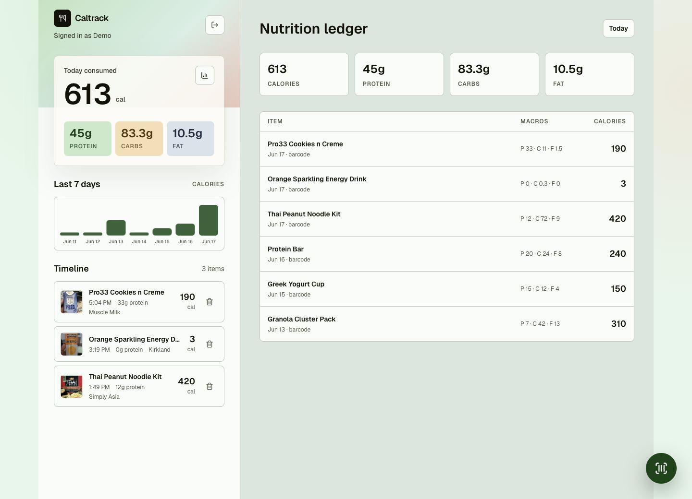
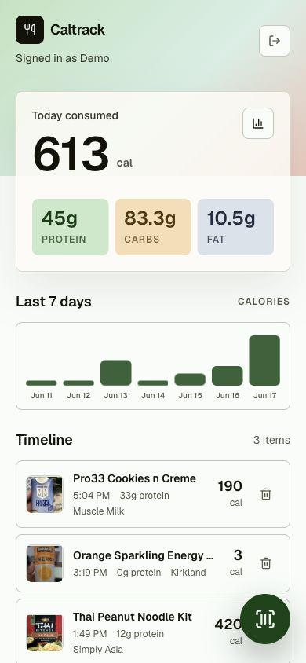

# Caltrack

<p align="center">
  <strong>A barcode-first calorie journal for people who want fast logging without nutrition-app bloat.</strong>
</p>

<p align="center">
  <a href="https://github.com/rootsec1/caltrack/blob/main/LICENSE"></a>
  
  
  
  
</p>

<p align="center">
  
</p>

<p align="center">
  
</p>

Caltrack is a mobile-first Next.js PWA for private food logging. Scan a packaged item, fetch nutrition from Open Food Facts, confirm the label, and save it to a flat daily timeline. If there is no barcode, open the same review sheet with blank editable fields and fill the nutrition label manually.

The input model is intentionally small: barcode scan first, manual entry only when a barcode is not available. No calorie goals, no meal buckets, no photo storage, no server management.

## Highlights

- Barcode scanning with `@zxing/browser` and an opportunistic native `BarcodeDetector` fast path.
- Open Food Facts lookup with product images and normalized calories, protein, carbs, and fat.
- `product_cache` stores barcode nutrition data so repeat scans do not call the public API again.
- Better Auth email/password accounts with Drizzle-backed users and sessions.
- SQLite-compatible libSQL file for local development, Turso/libSQL for low-cost production on Vercel.
- Mobile-first dashboard with daily totals, macro tiles, weekly history, timeline, and floating scan action.
- Bun-only toolchain: install, test, build, and database scripts all run through Bun.

## Stack

| Layer | Choice |
| --- | --- |
| App | Next.js App Router, React, TypeScript |
| Styling | Tailwind CSS with local UI primitives |
| Auth | Better Auth, email/password |
| Data | Drizzle ORM, SQLite/libSQL locally, Turso/libSQL in production |
| Barcode | `@zxing/browser`, native `BarcodeDetector` when available |
| Nutrition API | Open Food Facts |
| Runtime | Bun |
| Deploy | Vercel + Turso |

## Quick Start

```bash
bun install
cp .env.example .env.local
openssl rand -base64 32
bun run db:migrate
bun dev
```

Set the generated secret as `BETTER_AUTH_SECRET` in `.env.local`, then open [http://localhost:3000](http://localhost:3000).

## Environment

Required locally:

```bash
DATABASE_URL=file:./.data/caltrack.db
BETTER_AUTH_URL=http://localhost:3000
BETTER_AUTH_SECRET=replace-with-openssl-rand-base64-32
OPENFOODFACTS_USER_AGENT=Caltrack/1.0 (you@example.com)
GEMINI_API_KEY=
GEMINI_MODEL=gemini-3.1-flash-lite
```

Required on Vercel with Turso:

```bash
TURSO_DATABASE_URL=
TURSO_AUTH_TOKEN=
BETTER_AUTH_SECRET=
NEXT_PUBLIC_BETTER_AUTH_URL=https://your-domain.example
OPENFOODFACTS_USER_AGENT=Caltrack/1.0 (you@example.com)
GEMINI_API_KEY=
GEMINI_MODEL=gemini-3.1-flash-lite
```

Use a real contact in `OPENFOODFACTS_USER_AGENT`; Open Food Facts asks API clients to identify themselves clearly.
`GEMINI_API_KEY` is only used server-side for no-barcode nutrition estimates.

## Database

Local development uses a libSQL-compatible SQLite file at `.data/caltrack.db`.

```bash
bun run db:generate
bun run db:migrate
```

If existing cached products or food logs are missing product thumbnails:

```bash
bun run db:backfill-images
```

Core app tables:

- `food_logs`: authenticated user logs, timestamp, item, serving, calories, protein, carbs, fat, note, source, confidence, assumptions.
- `product_cache`: barcode-keyed normalized Open Food Facts product data, product image, nutrition, original payload, fetch timestamp.
- Better Auth tables: `user`, `session`, `account`, `verification`.

## Deployment

The intended cheap deployment path is Vercel plus Turso.

1. Create a Turso database.
2. Add the production environment variables in Vercel.
3. Run migrations with `TURSO_DATABASE_URL` and `TURSO_AUTH_TOKEN` set.
4. Deploy the Next.js app to Vercel.

No long-running server or background worker is required.

## Privacy

- Food photos are not accepted or stored.
- Barcode lookup data is cached in your database to reduce repeated Open Food Facts calls.
- Food logs are scoped to the authenticated user.
- Secrets belong in environment variables only. Do not commit `.env.local`, `.data`, `.next`, or `node_modules`.

## Scripts

```bash
bun run lint
bun run test
bun run build
bun run db:generate
bun run db:migrate
bun run db:backfill-images
```

## Contributing

Keep the product small and barcode-first. Prefer focused changes, tests for nutrition normalization or log aggregation changes, and screenshots for UI work that changes the visible product.

Security issues should follow [SECURITY.md](./SECURITY.md). Everything else can go through issues or pull requests.

## License

MIT. See [LICENSE](./LICENSE).
